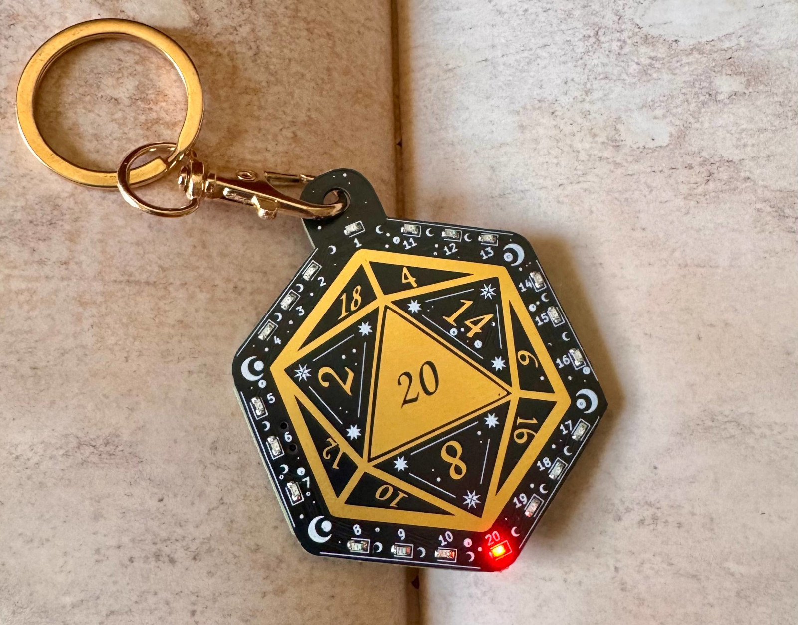
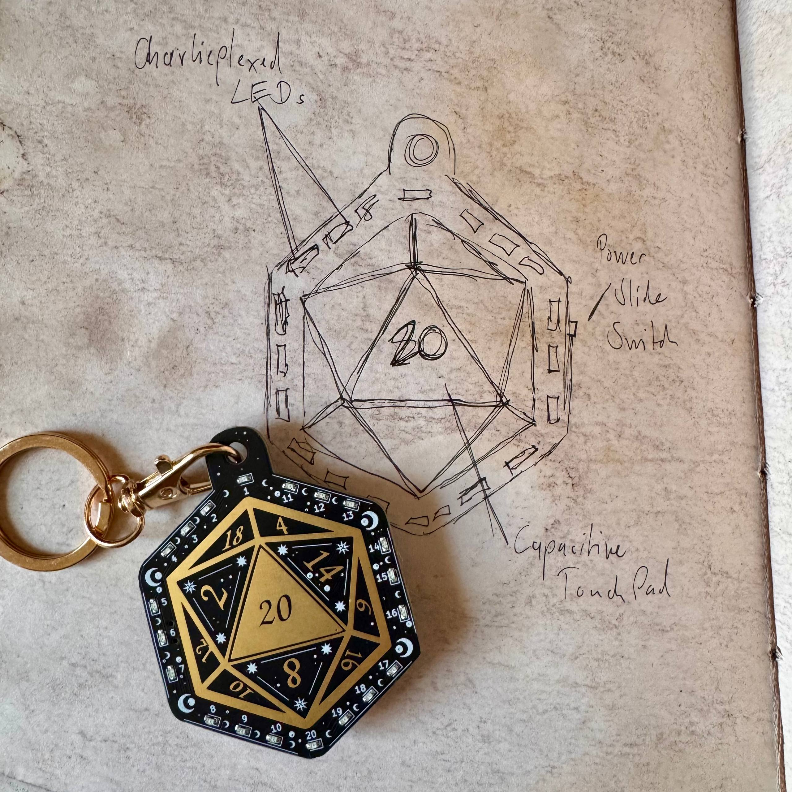
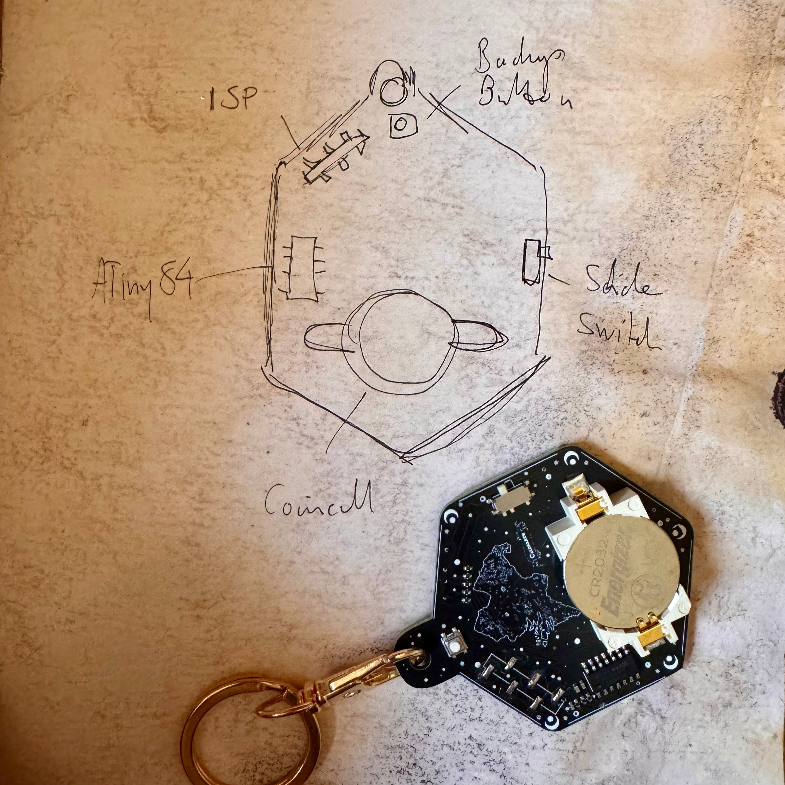

# d20 PCB

A handheld electronic D20 built as a DnD-themed PCB project.

The board uses an ATtiny84, charlieplexed LEDs, capacitive touch input,
custom animations, EEPROM-backed "attunement", and hidden easter eggs to
turn a PCB into a slightly magical-feeling tabletop artifact. For dice
rolls, dramatic failures, heroic last minutes, and other shenanigans ;)

<p align="center">
  
</p>

## Features

- Electronic D20 with animated rolls
- Capacitive touch dice rolling
- Character-specific animation variants
- EEPROM-backed attunement system
- Hidden easter eggs and secret modes
- Fully open hardware and open source firmware
- Mildly questionable choices and amounts of whimsy

## Usage

### Power On

Turn on the board using the slide switch on the right side.

The board spends most of its existence asleep, patiently waiting for
an adventurer to wake it.

### Wake Up

Press the push button on the back once to wake the board.

The LEDs should come to life shortly afterwards.

### Rolling

Rolls can be triggered either by:

- pressing the push button
- briefly touching and releasing the `20` touch pad

The pushbutton has the power to interrupt rolls, should fate require it.

The touch sensor is intentionally configured conservatively to avoid
accidental triggers and random table wizardry (everyone who's seen an actual Pen and Paper table will know why).

Touch works best while holding the board in your hand and touching the
pad between thumb and index finger (there has been some discussion about
this...).

Touch sensitivity can be adjusted in `firmware/src/touch.c`.

See the firmware README for more information.

## Attunement

The board features a small "attunement" system inspired by magical items
in tabletop RPGs.

On first activation, the firmware stores a tiny hardware-specific value in
EEPROM based on touch pad readings. This subtly affects animation timing
and behavior, making each board feel ever so slightly different.

## Repository Structure

```text
hardware/   KiCad PCB design, manufacturing files and artwork
firmware/   ATtiny84 firmware and test infrastructure
docs/       Images and documentation assets
```

Detailed instructions are available in:

- [hardware/README.md](hardware/README.md)
- [firmware/README.md](firmware/README.md)

## Easter Eggs

The firmware contains several hidden interactions and modes and, yeah, an attitude.

Some are obvious.
Some are less obvious.

Some still haven't been found yet.

<p align="center">
  
  
</p>

## Project Background

This project originally started as a handmade DnD-themed gift for my
players, with far more LEDs, firmware, and suspicious EEPROM usage than originally planned.
And now it's an open hardware project.

There's customisation for both the players and the campaign hidden
throughout the project because of how it came to be.
The different character's animation can be interpreted as flavour and compiled in to your liking.

## Further Reading

- Project blog post: https://missmolerat.com/posts/d20_pcb/
- Hackaday: https://hackaday.com/2026/05/25/slightly-sentient-d20-might-subtly-shift-your-rolls/

## Licenses

- Hardware: CERN Open Hardware License
- Firmware: GPL-3.0-only
