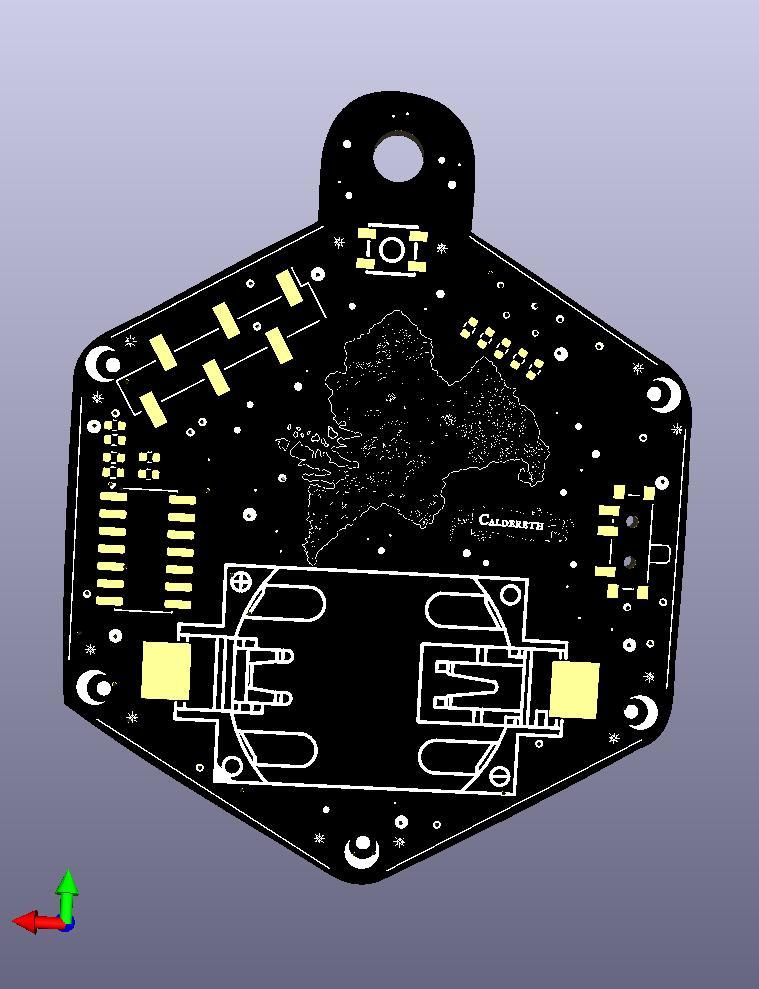

# d20 PCB – Hardware

This directory contains the KiCad design files, artwork, and
manufacturing outputs for the d20 PCB.

The board is a small ATtiny-based electronic die with 20 LEDs arranged
around the edge of a d20-shaped PCB. A capacitive touch pad triggers a
roll animation and displays a random result.

## Hardware Overview

Main components:

- ATtiny84 microcontroller
- 20 LEDs arranged in a ring (charlieplexed)
- Capacitive touch pad for input
- Coin cell battery holder
- Push button (optional backup input)

## Directory Structure

KiCad project files
    d20_pcb.kicad_pro
    d20_pcb.kicad_sch
    d20_pcb.kicad_pcb
    
artwork/
    SVG artwork used for silkscreen and copper layers.

libraries/
    Project-local KiCad symbol and footprint libraries.

fabrication/
    Generated manufacturing files:
      - gerbers/
      - drill/
      - bom/
      - pickplace/

fabrication/jlcpcb/
    Vendor-specific BOM and placement files for JLCPCB assembly.

## KiCad Project

The board is designed using KiCad.

Main files:

- d20_pcb.kicad_pro – project file
- d20_pcb.kicad_sch – schematic
- d20_pcb.kicad_pcb – PCB layout

The project uses local libraries located in:

libraries/

## Artwork

Silkscreen and copper artwork is stored as SVG files in:

artwork/

These files were used to create the decorative PCB elements such as:
- board outline
- line art
- map on the back
- decorative stars and moons

## Manufacturing

All required manufacturing outputs are located in:

fabrication/

To manufacture the board:

1. Upload files from `fabrication/gerbers/` to a PCB manufacturer.
2. Use files from `fabrication/drill/` for drilling information.
3. Use the BOM and pick-and-place files for assembly (note: detailed BOM with parts and values is in jlcpcb/)

Vendor-specific assembly files for JLCPCB are provided in:

fabrication/jlcpcb/

Alternatively:
The files in `fabrication/releases/` contain the currently tested and
successfully manufactured board revision.

If you modify the KiCad source files, you should regenerate and review
all fabrication outputs (Gerbers, drill files, BOM, pick-and-place files)
before ordering boards.

Even small PCB edits can invalidate previously generated fabrication files.

If you are new to PCB manufacturing, it is recommended to use the tested
release files directly instead of generating new Gerbers yourself.

## Regenerating Fabrication Files

Manufacturing files can be regenerated from KiCad:

PCB Editor → Fabrication Outputs

## License

This hardware design is licensed under the CERN Open Hardware Licence
Version 2 – Strongly Reciprocal (CERN-OHL-S v2).

You may manufacture, modify and sell products based on this design,
provided that any modifications to the design files are released under
the same license.

The full license text is available in the LICENSE file.
