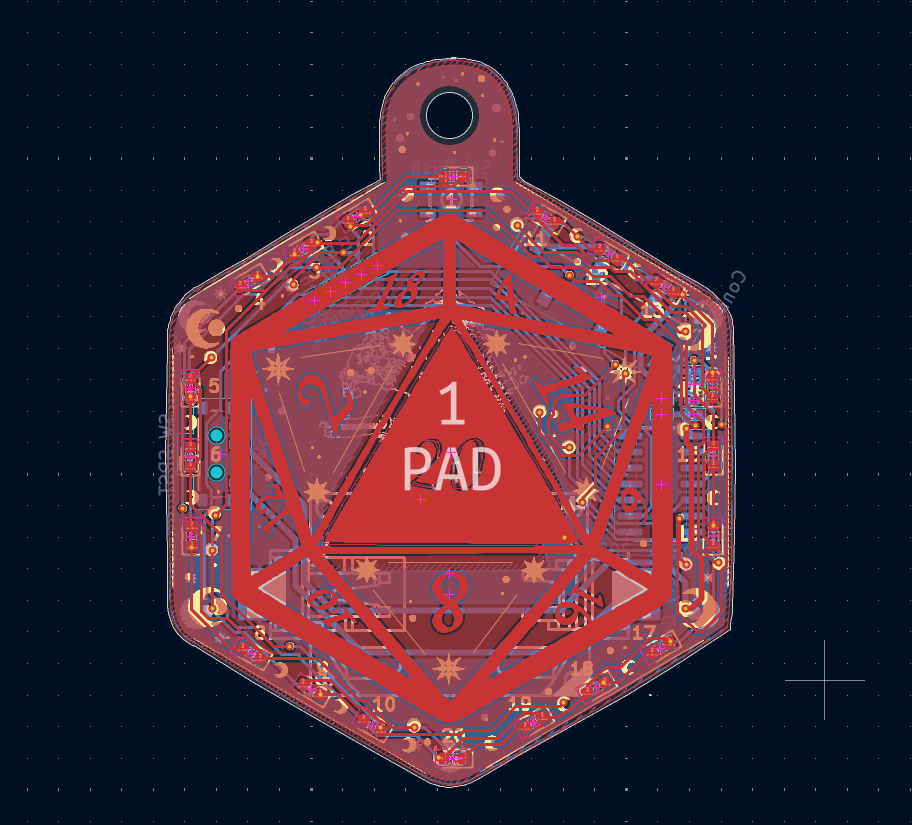
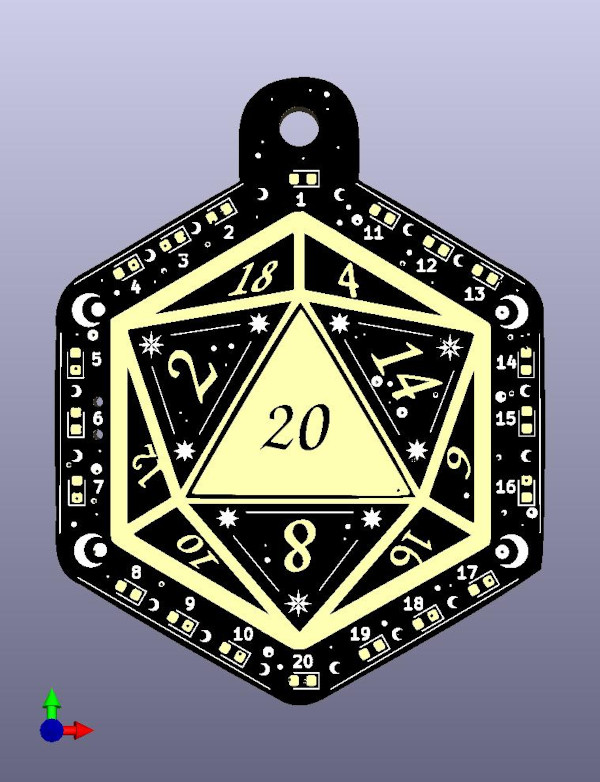
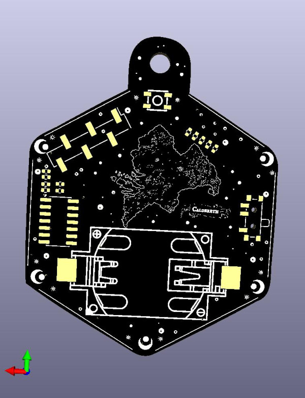
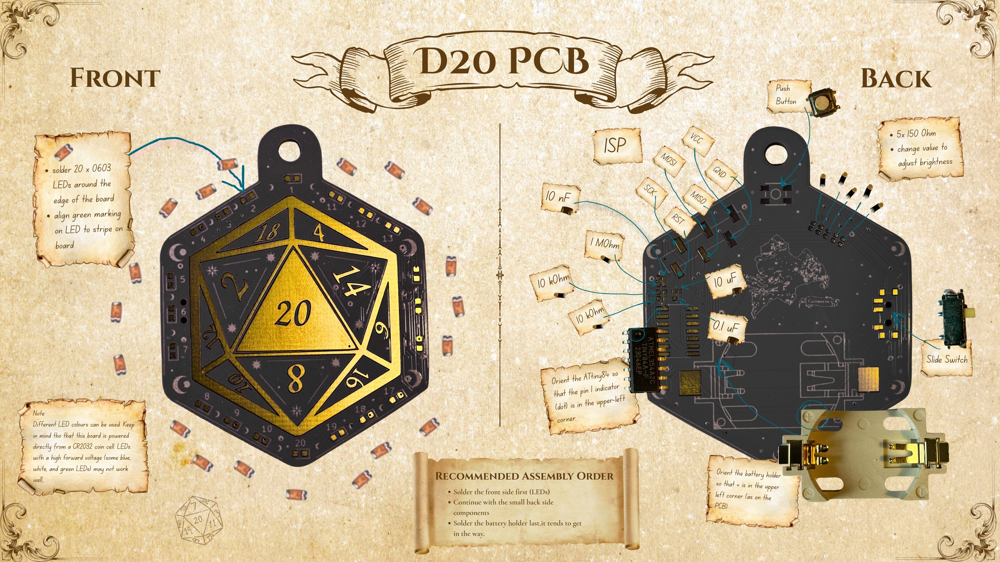
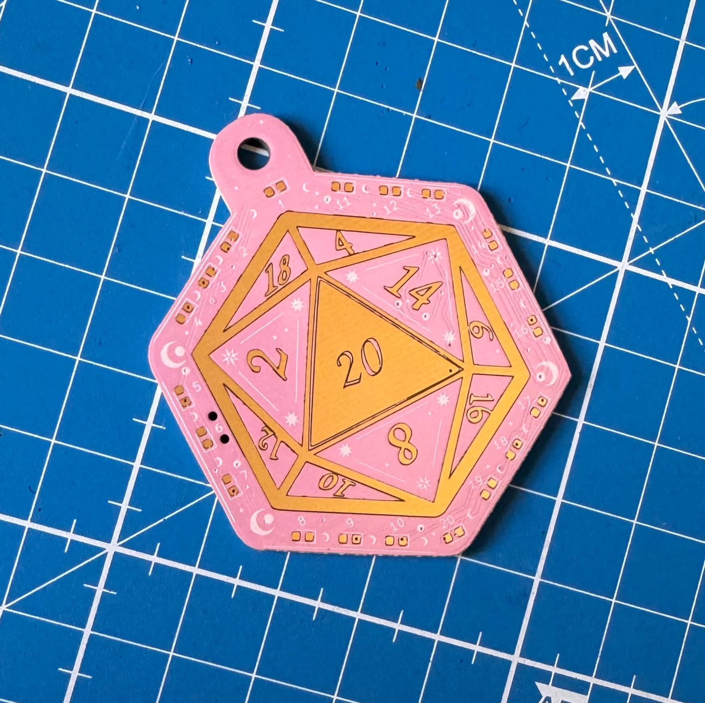
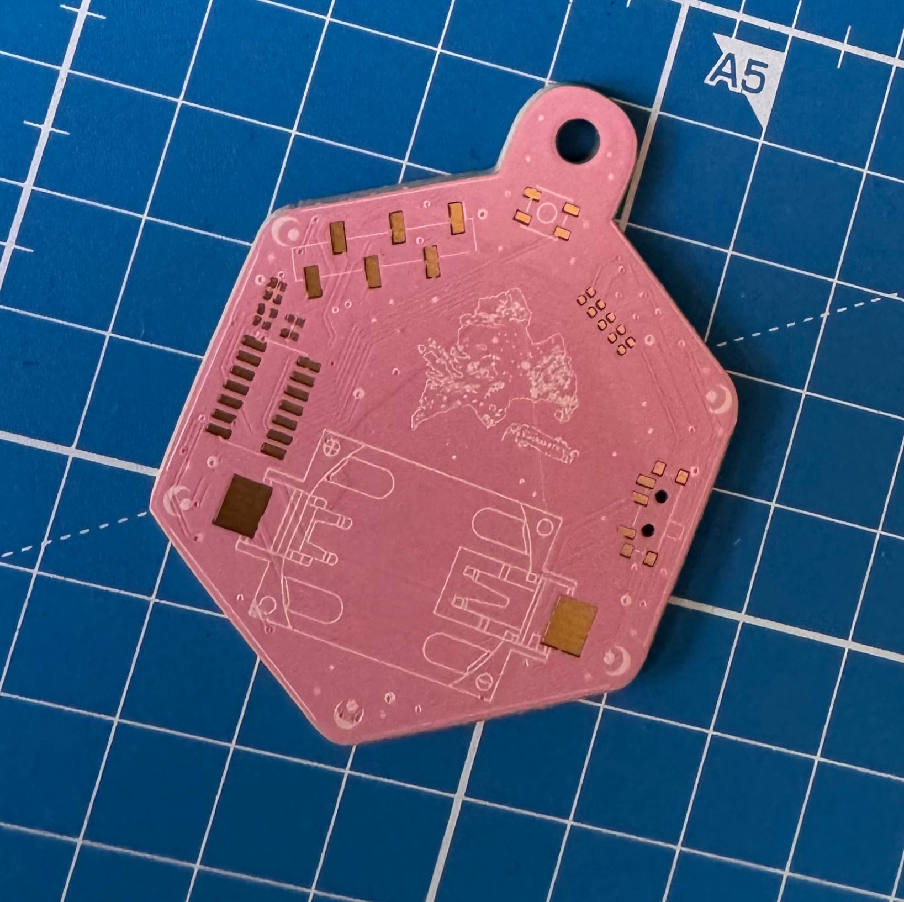
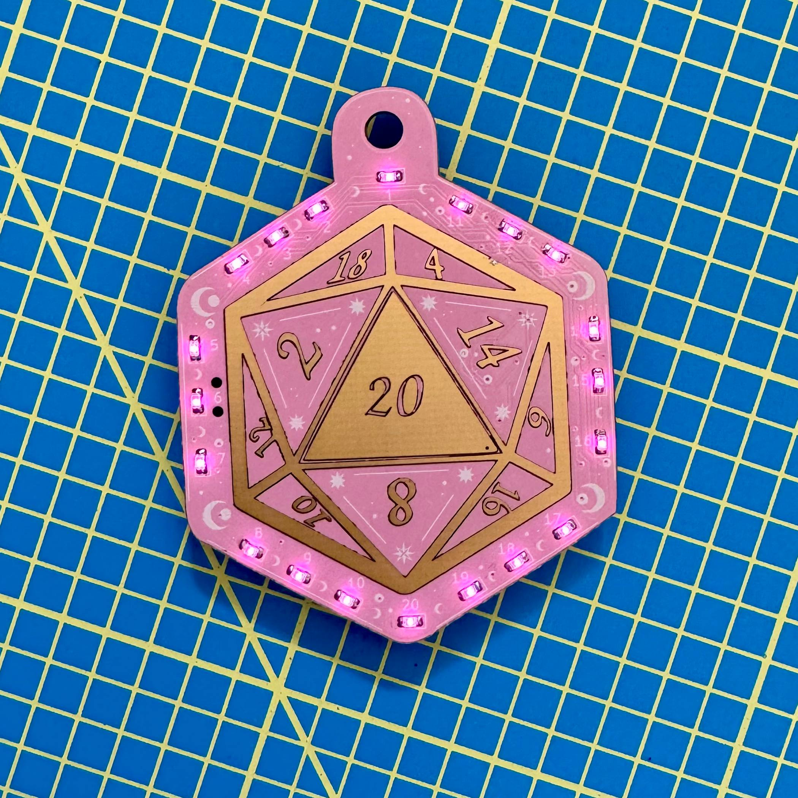

# d20 PCB – Hardware

<p align="center">
  
</p>

This directory contains the KiCad design files, artwork, and
manufacturing outputs for the d20 PCB.

The board is a small ATtiny-based electronic die with 20 LEDs arranged
around the edge of a d20-shaped PCB. A capacitive touch pad triggers a
roll animation and displays a random result.

## Hardware Overview

Main components:

- ATtiny84 microcontroller
- 20 LEDs arranged in a ring (charlieplexed)
- Capacitive touch pad for input
- Coin cell battery holder
- Push button (optional backup input)

## Directory Structure

```text
d20_pcb.kicad_pro
d20_pcb.kicad_sch
d20_pcb.kicad_pcb
```

KiCad project files.

```text
artwork/
```

SVG artwork used for silkscreen and copper layers.

```text
libraries/
```

Project-local KiCad symbol and footprint libraries.

```text
fabrication/
```

Generated manufacturing files:

- `gerbers/`
- `drill/`
- `bom/`
- `pickplace/`

```text
fabrication/jlcpcb/
```

Vendor-specific BOM and placement files for JLCPCB assembly.

## KiCad Project

The board is designed using KiCad.

Main files:

- `d20_pcb.kicad_pro` – project file
- `d20_pcb.kicad_sch` – schematic
- `d20_pcb.kicad_pcb` – PCB layout

The project uses local libraries located in:

```text
libraries/
```

## Artwork

Silkscreen and copper artwork is stored as SVG files in:

```text
artwork/
```

These files were used to create decorative PCB elements such as:

- board outline
- line art
- map on the back
- decorative stars and moons

## Manufacturing

<p align="center">
  
  
</p>

All required manufacturing outputs are located in:

```text
fabrication/
```

To manufacture the board:

1. Upload files from `fabrication/gerbers/` to a PCB manufacturer.
2. Use files from `fabrication/drill/` for drilling information.
3. Use the BOM and pick-and-place files for assembly.

Note: the more detailed assembly BOM with parts and values is located in:

```text
fabrication/jlcpcb/
```

Alternatively:

The files in `fabrication/releases/` contain the currently tested and
successfully manufactured board revision.

If you modify the KiCad source files, you should regenerate and review
all fabrication outputs (Gerbers, drill files, BOM, and pick-and-place
files) before ordering boards.

Even small PCB edits can invalidate previously generated fabrication
files.

If you are new to PCB manufacturing, it is recommended to use the tested
release files directly instead of generating new Gerbers yourself.

## Regenerating Fabrication Files

Manufacturing files can be regenerated from KiCad:

```text
PCB Editor → Fabrication Outputs
```

## Assembly

### Supplies

* soldering iron (alternatively: heat plate or hot air)
* solder (alternatively: solder paste)
* flux
* fume extractor or a well-ventilated space

### Parts

Many of the parts are influenced by what I had at home at the time.

Quite a few can be swapped for whatever matches the footprint. I found that old TV remotes are wonderful donors for slide switches and push buttons, for example. At least that's where I got these components from.

* 20 x SMD LEDs (0603)
* 1 x 0.1 µF capacitor (0402)
* 1 x 10 µF capacitor (0402)
* 1 x 10 nF capacitor (0402)
* 5 x 150 Ω resistors (0402)
* 2 x 10 kΩ resistors (0402)
* 1 x 1 MΩ resistor (0402)
* 1 x Keystone 1060TR battery holder
* 1 x CR2032 coin cell battery
* 1 x ATtiny84-20P Microchip ATTINY84A-SSF
* 1 x SPDT slide switch (see footprint; many ~8 mm SMD slide switches will fit, AliExpress has quite a few)
* 1 x push button (same here; 3.4 x 3.4 mm SMD push buttons often work)

I'd really love to point towards specific components for the slide switch or push button. But apart from sourcing the part via JLCPCB assembly or scavenging it, I have none.

Really, have faith: as long as you manage to connect the footprint pads with the part pins somehow, a lot of switches will work here (source: trust me bro).

### Soldering

<p align="center">
  
</p>

## Colour Suggestions

The board was intentionally designed with colourful solder masks and
ENIG finishes in mind.

~~I'd really love to see a pink board!~~

Mission accomplished :D

<p align="center">
  
  
</p>

<p align="center">
  
</p>

For comparison, here are the original render concepts:

<p align="center">
  
  
</p>

## License

This hardware design is licensed under the CERN Open Hardware Licence
Version 2 – Strongly Reciprocal (CERN-OHL-S v2).

You may manufacture, modify and sell products based on this design,
provided that any modifications to the design files are released under
the same license.

The full license text is available in the LICENSE file.